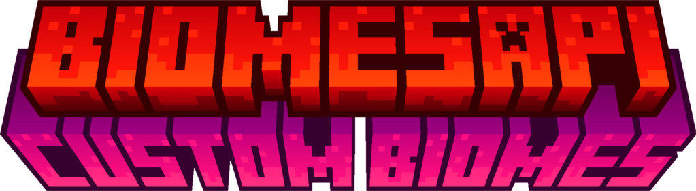

<div align="center">
    <h1>BiomesAPI</h1>
    <p>Custom biomes, dimensions, and world generation for Paper servers without datapacks.</p>
    
    
    
</div>

---


## Docs 📚

Documentation for BiomesAPI can be found at https://biomes.lumas.dev. 
Documentation is still under construction!

## About 📃

BiomesAPI is a custom biome, dimensions, and world generation API for PaperMC Servers. This API is a fork of Outspending's original BiomesAPI and
has been updated to support the **modern** Minecraft versions. Currently, we support Minecraft **1.21.11 <-> 26.2**
but version support will expand with time.


Please be aware that BiomesAPI is in active development, and some features may not be fully implemented yet.
BiomesAPI was made for servers who are looking for more of an aesthetic feel to their builds.


## Getting Started ⭐

BiomesAPI is built using Gradle and is hosted on my repository (repo.jsinco.dev). To get started with BiomesAPI,
follow the instructions below to add BiomesAPI to your project.

1. Find the latest version of BiomesAPI [HERE](https://repo.jsinco.dev/#/releases/me/outspending/biomesapi/BiomesAPI). Versions with a git commit hash at the end are snapshot builds and may be unstable.
2. Add the repository to your `build.gradle.kts`, `build.gradle`, or `pom.xml` file.

And example for Gradle Kotlin DSL is provided below:

```kotlin
plugins {
    // Make sure to shade it in if you're not using it as an external dependency!
    id("com.gradleup.shadow") version "$SHADOW_VERSION"
}


repositories {
    maven("https://repo.jsinco.dev/releases")
}

// 3. Replace VERSION with the latest version found in step 1
dependencies {
    implementation("me.outspending.biomesapi:BiomesAPI:$VERSION")
}

// 4. Shade the BiomesAPI package to avoid conflicts
shadowJar {
    relocate("me.outspending.biomesapi", "your.package.name.biomesapi")
}
```

BiomesAPI comes as a shaded dependency or a standalone plugin, take your pick!

## Why BiomesAPI 🤔

I believe that BiomesAPI is one of the best ways to create custom biomes on a Paper-based Minecraft server.
At the time of writing, there are no other APIs that allow you to create custom biomes as easily as BiomesAPI does.

BiomesAPI is designed to be easy to use, flexible, and friendly for developers of all skill levels.

## Features 👌


- Easy to use
- Updated frequently
- Free forever
- Wiki and javadocs available
- Supports modern Minecraft versions
- Supports packet-based biome changing with ProtocolLib or PacketEvents

## Credits 🙏
BiomesAPI was originally created by Outspending. I (Jsinco) have forked the project to add additional features and
support modern Minecraft versions. This project would not be possible without Outspending's original work.

## Contributing 📰

Contributions are welcome! If you find a bug or have a feature request, please open an issue on GitHub.

## License 🪪
BiomesAPI is licensed under the [GPL-3.0 License](LICENSE)
